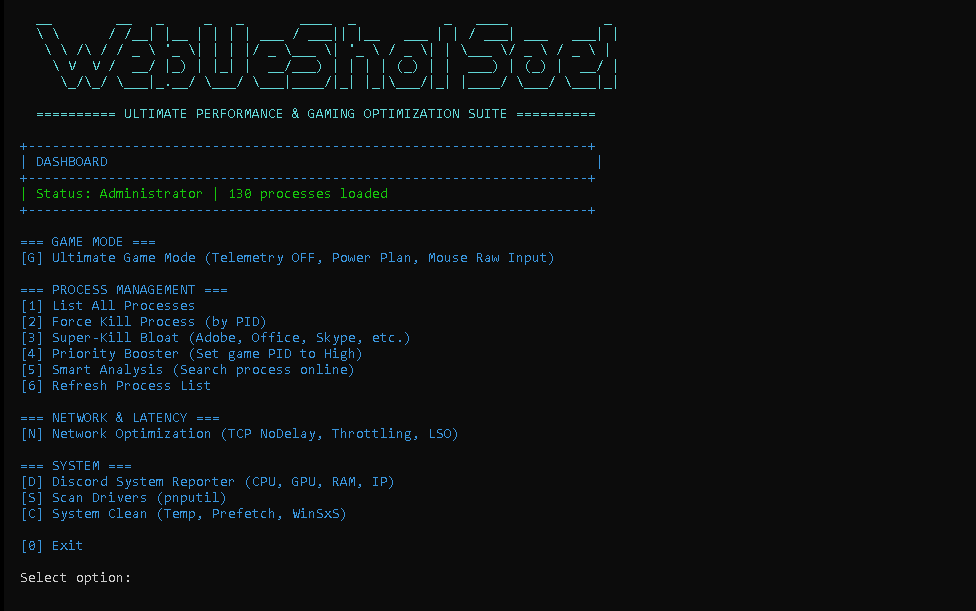

English Version
Ultimate Performance and Gaming Optimization Suite
An advanced command-line interface (CLI) suite developed to maximize Windows operating system efficiency. This tool focuses on latency reduction, process management, and hardware resource allocation to provide an optimal environment for high-end gaming and professional workloads.
Core Features
1. Gaming Optimization
• Ultimate Game Mode: Enables the highest performance power profile and disables system telemetry and background data collection.
• Power Plan Tuning: Adjusts processor scheduling and energy states to ensure zero throttling during intense tasks.
• Input Latency Reduction: Optimizes mouse and keyboard response rates by enabling raw input settings and disabling pointer precision enhancements.
2. Process Management
• Advanced Process Termination: Includes a "Super-Kill" feature to instantly stop non-essential software such as Office, Skype, and various cloud synchronization services.
• CPU Priority Management: Automatically sets specified gaming processes to High Priority to ensure they receive maximum CPU cycles.
• Smart Process Analysis: Provides a built-in search functionality to analyze running strings and identify their origin and impact on system stability.
3. Network and Latency
• TCP Optimization: Implements TCP NoDelay (Nagle's Algorithm) to reduce network packet buffering.
• Network Throttling Disable: Removes Windows network throttling index to maintain consistent internet speeds during multiplayer sessions.
4. System Maintenance
• Hardware Reporting: Generates a detailed technical report including CPU, GPU, RAM specifications, and network configuration.
• System Cleanup: Automates the removal of temporary files (Temp), Prefetch data, and WinSxS backup folders.
• Driver Management: Utilizes the pnputil tool to scan and verify the status of installed hardware drivers.

النسخة العربية
مجموعة أدوات تحسين الأداء والألعاب القصوى
مجموعة أدوات متقدمة تعمل عبر واجهة الأوامر السطرية تم تطويرها لرفع كفاءة نظام التشغيل ويندوز إلى أقصى حد ممكن. تركز هذه الأداة على تقليل زمن الاستجابة، إدارة العمليات، وتخصيص موارد الأجهزة لتوفير بيئة مثالية للألعاب المتطلبة وسير العمل الاحترافي.
المميزات الأساسية
1. تحسين الألعاب
• وضع الألعاب الأقصى: تفعيل ملف تعريف الطاقة للأداء العالي وتعطيل خدمات التتبع وجمع البيانات في الخلفية.
• ضبط خطة الطاقة: تعديل جدولة المعالج وحالات الطاقة لضمان عدم انخفاض الأداء أثناء المهام المكثفة.
• تقليل تأخير الإدخال: تحسين معدلات استجابة الماوس ولوحة المفاتيح عبر تفعيل الإدخال المباشر وتعطيل ميزات تحسين دقة المؤشر.
2. إدارة العمليات
• إنهاء العمليات المتقدم: تتضمن ميزة القتل الفوري لإيقاف البرامج غير الضرورية مثل أوفيس، سكاي بي، وخدمات المزامنة السحابية المختلفة.
• إدارة أولوية المعالج: تعيين عمليات ألعاب محددة لتكون ذات أولوية عالية تلقائياً لضمان حصولها على أقصى طاقة من المعالج.
• التحليل الذكي للعمليات: توفر وظيفة بحث مدمجة لتحليل النصوص البرمجية المشغلة وتحديد مصدرها وتأثيرها على استقرار النظام.
3. الشبكة وزمن الاستجابة
• تحسين بروتوكول TCP: تطبيق إعدادات لتقليل تخزين حزم البيانات في الشبكة مما يقلل من زمن الوصول.
• تعطيل خنق الشبكة: إزالة مؤشر خنق الشبكة في ويندوز للحفاظ على سرعات إنترنت ثابتة أثناء اللعب عبر الإنترنت.
4. صيانة النظام
• تقارير العتاد: إنشاء تقرير فني مفصل يتضمن مواصفات المعالج، كرت الشاشة، الذاكرة العشوائية، وإعدادات الشبكة.
• تنظيف النظام: أتمتة إزالة الملفات المؤقتة، بيانات التخزين المسبق، ومجلدات النسخ الاحتياطي لـ WinSxS.
• إدارة التعريفات: استخدام أداة pnputil لفحص والتحقق من حالة تعريفات الأجهزة المثبتة.

### Contact & Support
Join our [Discord Server](https://discord.gg/5BbJwYNhm2)
